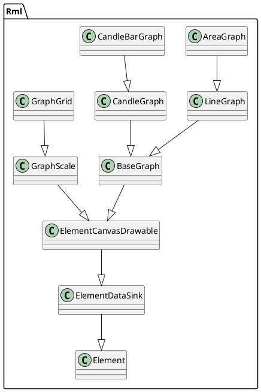

```plantuml
@startuml graphs

namespace Rml {
class Element
class ElementCanvasDrawable
'ElementCanvasDrawable --|> Element
class AreaGraph
AreaGraph --|> LineGraph
class BaseGraph
BaseGraph --|> ElementCanvasDrawable
class ElementDataSink
'BaseGraph --|> ElementDataSink
'BaseGraph --|> Element
class CandleGraph
CandleGraph --|> BaseGraph
class CandleBarGraph
CandleBarGraph --|> CandleGraph
class GraphScale
GraphScale --|> ElementCanvasDrawable
'GraphScale --|> Element
class GraphGrid
GraphGrid --|> GraphScale
class LineGraph 
LineGraph --|> BaseGraph

ElementCanvasDrawable --|> ElementDataSink
ElementDataSink --|> Element
}
@enduml
```